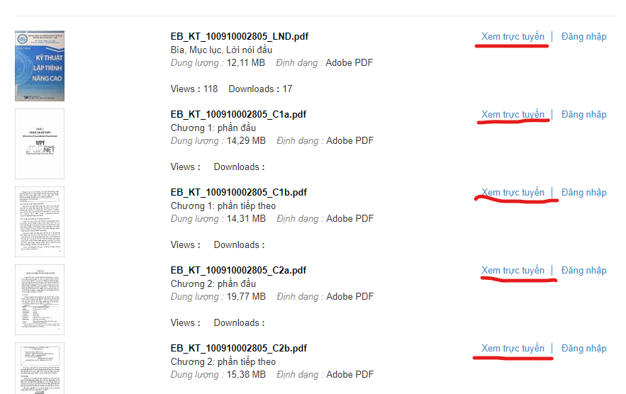
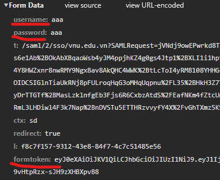

# Tải eBook từ VNU-LIB

## 1. Tôi đã xây dựng tool này như thế nào?

- Theo lời đề nghị từ một người bạn, tôi đã dành 1 tiếng để nghiên cứu cách 1 trang sách render như thế nào. Sau đó tôi dành tận **1 NGÀY** để code nên cái tool sơ xài này.

- Nếu để ý cách 1 mục render ra các trang sách, thì url của các trang có cùng 1 format `https://ir.vnulib.edu.vn/flowpaper/services/view.php?doc={}&format=jpg&page={}&subfolder={}`. Do đó, chỉ cần biết tổng số trang là có thể truy cập được tất cả ảnh.

- Tuy nhiên, những mục chia của sách chỉ khả dụng cho những người dùng đã đăng nhập.

    

    Do đó, tôi lại phải mất công làm công đoạn đăng nhập dài dòng này.

- Khi mày mò thì tôi đã tìm ra trang đăng nhập, ban đầu tôi chỉ nghĩ khi ấn `submit`, client sẽ chỉ gửi đi form-data là `username` và `password`. Nhưng không! Nó còn kèm theo cả `formToken`

    

    Nên việc sử dụng `requests` để POST có lẽ là không khả dụng.

- Vì vậy, tôi chuyển qua `selenium` để thao tác thủ công và nó hoạt động rất ổn áp. 

- Nhưng trước tiên là tôi phải cần 1 cái `chromedriver.exe`. Do đó, tôi đã viết một file ngắn để tự động kiểm tra và cập nhật driver mỗi lần chạy script (dùng `wget`)

- Sau một lúc inspect element, tôi đã rõ cấu trúc của các file ảnh và cuối cùng là thu thập hết chúng và lại dùng `requests` để lưu ảnh về local.

- Cuối cùng thì chỉ cần merge hết ảnh lại và xuất ra pdf thôi (dùng `img2pdf`).

- **Khá đơn giản nhỉ?**

## 2. Cách chạy tool

> Để đảm bảo không có đột biến với các dự án khác trên máy của bạn, tool này tạo một môi trường ảo và tải những packages cần thiết trong đó.

+ Điền username và password vào file `authorization.json`.
+ Chạy `run.bat`.
+ Nhập tên đường dẫn (dạng `https://ir.vnulib.edu.vn/handle/VNUHCM/31319`). Có thể nhập nhiều đường dẫn cách nhau bằng space.
+ Tuỳ chọn xoá các file ảnh khi xuất xong pdf (nếu cần).
+ Đợi script chạy và hoàn thành.

## 3. Demo

**[Downloader demo on Youtube](https://youtu.be/rdQH4tIuVdI)**

## 4. Bugs

- Nếu bạn phát hiện bugs, hãy đăng issues! Thanks!!!
